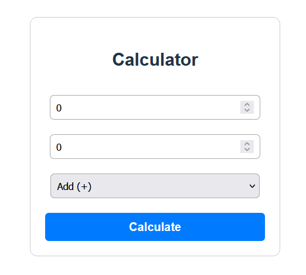

# Day 2 A simple Calculator 
  # Topic Coverd in Day 2 
    1. Functions in TypeScript
    2. Union & Intersection Types
    3. Type Aliases
    4. Functions + Type Aliases
    => Diff b/w interface and type
      -> check notes /docs/day2.txt

# Day 2 A simple Calculator 
  Tech stacks : React+TS+useReducer hook
    Here’s what i build while learing ts on day two:
        => Defined a State interface (clear shape of state).
        => Used union in Action type → each action is strictly typed.
        => Implemented a reducer instead of multiple useState → scalable for more operations.
        => Proper error handling (division by zero).
        => Clean UI with inline CSS → minimal distractions, focus on TS + logic.

        

